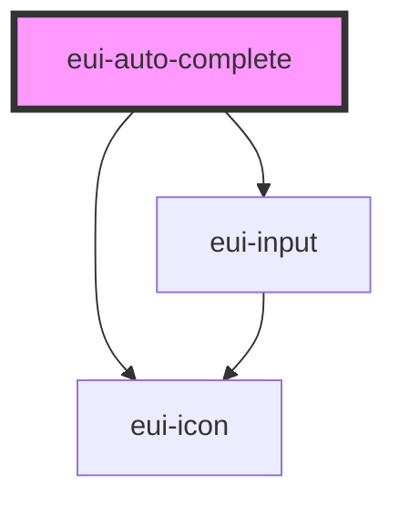

# eui-auto-complete

<!-- Auto Generated Below -->

## Properties

| Property           | Attribute           | Description | Type                                               | Default     |
| ------------------ | ------------------- | ----------- | -------------------------------------------------- | ----------- |
| `displayField`     | `display-field`     |             | `string \| undefined`                              | `undefined` |
| `fetchSuggestions` | `fetch-suggestions` |             | `((query: string) => Promise<any[]>) \| undefined` | `undefined` |
| `placeholder`      | `placeholder`       |             | `string`                                           | `''`        |

## Events

| Event          | Description | Type               |
| -------------- | ----------- | ------------------ |
| `itemSelected` |             | `CustomEvent<any>` |

## Dependencies

### Depends on

- [eui-input](../input)
- [eui-icon](../icon)

### Graph

----------------------------------------------

*Built with [StencilJS](https://stenciljs.com/)*
