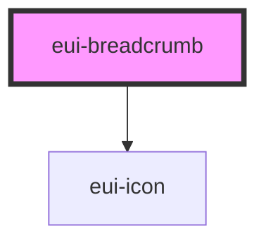

# eui-breadcrumb

<!-- Auto Generated Below -->

## Properties

| Property     | Attribute    | Description | Type                            | Default     |
| ------------ | ------------ | ----------- | ------------------------------- | ----------- |
| `data`       | `data`       |             | `BreadcrumbData[] \| undefined` | `undefined` |
| `styleValue` | `stylevalue` |             | `string \| undefined`           | `undefined` |

## Events

| Event       | Description | Type                          |
| ----------- | ----------- | ----------------------------- |
| `itemClick` |             | `CustomEvent<BreadcrumbData>` |

## Dependencies

### Depends on

- [eui-icon](../icon)

### Graph

----------------------------------------------

*Built with [StencilJS](https://stenciljs.com/)*
