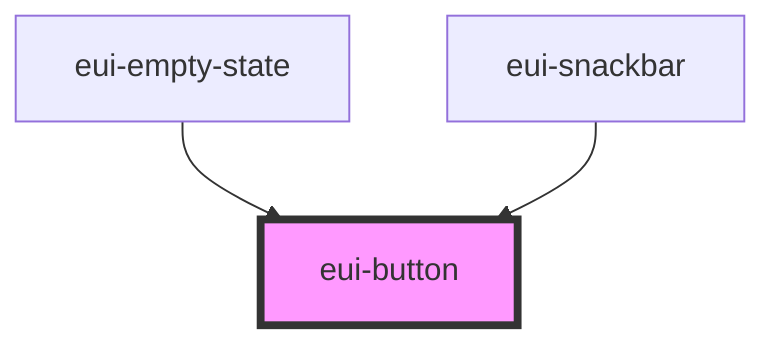

# ensemble-button

examples:

<eui-button size="sm" variant="primary">Small Primary</eui-button>
<eui-button size="lg" variant="danger">Large Danger</eui-button>
<eui-button size="2xl" variant="success" disabled>Disabled Success</eui-button>

<!-- Auto Generated Below -->

## Properties

| Property      | Attribute      | Description | Type                                                                     | Default     |
| ------------- | -------------- | ----------- | ------------------------------------------------------------------------ | ----------- |
| `mode`        | `mode`         |             | `"normal" \| "outline" \| "text-button"`                                 | `"normal"`  |
| `nativeAttrs` | `native-attrs` |             | `undefined \| { [x: string]: any; }`                                     | `undefined` |
| `size`        | `size`         |             | `"lg" \| "md" \| "sm"`                                                   | `"md"`      |
| `styleValue`  | `stylevalue`   |             | `string \| undefined`                                                    | `undefined` |
| `variant`     | `variant`      |             | `"danger" \| "info" \| "neutral" \| "primary" \| "success" \| "warning"` | `'primary'` |

## Dependencies

### Used by

 - [eui-empty-state](../empty-state)
 - [eui-snackbar](../snackbar)

### Graph

----------------------------------------------

*Built with [StencilJS](https://stenciljs.com/)*
