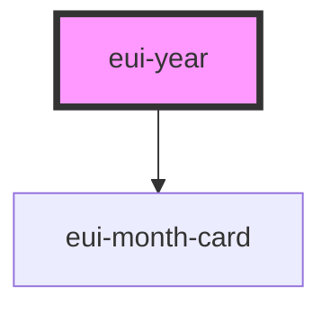

# eui-year

<!-- Auto Generated Below -->

## Properties

| Property           | Attribute          | Description | Type                                               | Default     |
| ------------------ | ------------------ | ----------- | -------------------------------------------------- | ----------- |
| `holidayEventType` | `holidayeventtype` |             | `"both" \| "international" \| "none" \| "persian"` | `"none"`    |
| `styleValue`       | `stylevalue`       |             | `string \| undefined`                              | `undefined` |
| `year`             | `year`             |             | `number \| string`                                 | `2000`      |

## Dependencies

### Depends on

- [eui-month-card](..)

### Graph

----------------------------------------------

*Built with [StencilJS](https://stenciljs.com/)*
