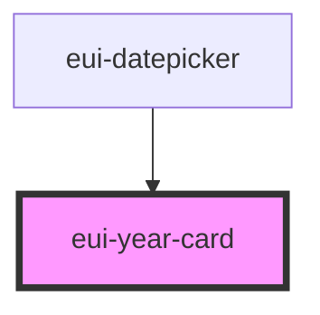

# eui-year

<!-- Auto Generated Below -->

## Properties

| Property           | Attribute          | Description | Type                                               | Default     |
| ------------------ | ------------------ | ----------- | -------------------------------------------------- | ----------- |
| `holidayEventType` | `holidayeventtype` |             | `"both" \| "international" \| "none" \| "persian"` | `"none"`    |
| `interactive`      | `interactive`      |             | `boolean`                                          | `true`      |
| `selectedDate`     | `selecteddate`     |             | `Date \| undefined`                                | `undefined` |
| `showHeader`       | `show-header`      |             | `boolean`                                          | `true`      |
| `styleValue`       | `stylevalue`       |             | `string \| undefined`                              | `undefined` |

## Events

| Event      | Description | Type                |
| ---------- | ----------- | ------------------- |
| `dayClick` |             | `CustomEvent<Date>` |

## Dependencies

### Used by

 - [eui-datepicker](../../datepicker)

### Graph

```mermaid
graph TD;
  eui-datepicker --> eui-year-card
  style eui-year-card fill:#f9f,stroke:#333,stroke-width:4px
```

----------------------------------------------

*Built with [StencilJS](https://stenciljs.com/)*
