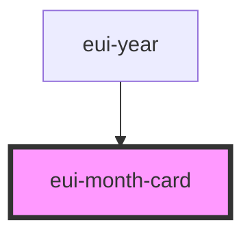

# eui-month-card

<!-- Auto Generated Below -->

## Properties

| Property             | Attribute          | Description | Type                                               | Default     |
| -------------------- | ------------------ | ----------- | -------------------------------------------------- | ----------- |
| `holidayEventType`   | `holidayeventtype` |             | `"both" \| "international" \| "none" \| "persian"` | `"none"`    |
| `interactive`        | `interactive`      |             | `boolean`                                          | `true`      |
| `month` _(required)_ | `month`            |             | `number`                                           | `undefined` |
| `selectedDate`       | `selecteddate`     |             | `Date \| undefined`                                | `undefined` |
| `styleValue`         | `stylevalue`       |             | `string \| undefined`                              | `undefined` |
| `year` _(required)_  | `year`             |             | `number`                                           | `undefined` |

## Events

| Event      | Description | Type                |
| ---------- | ----------- | ------------------- |
| `dayClick` |             | `CustomEvent<Date>` |

## Dependencies

### Used by

 - [eui-year](eui-calendar-body)

### Graph

----------------------------------------------

*Built with [StencilJS](https://stenciljs.com/)*
