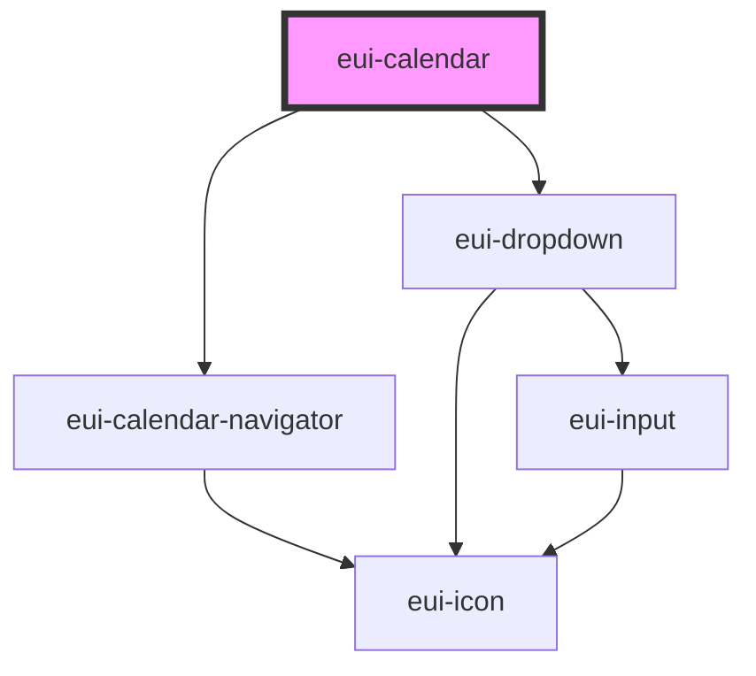

# eui-month-card

<!-- Auto Generated Below -->

## Properties

| Property           | Attribute          | Description | Type                                                                                               | Default                 |
| ------------------ | ------------------ | ----------- | -------------------------------------------------------------------------------------------------- | ----------------------- |
| `calendarViewMode` | `calendarviewmode` |             | `CalendarViewEnum.day \| CalendarViewEnum.month \| CalendarViewEnum.week \| CalendarViewEnum.year` | `CalendarViewEnum.year` |
| `interactive`      | `interactive`      |             | `boolean`                                                                                          | `true`                  |
| `selectedDate`     | `selecteddate`     |             | `Date \| undefined`                                                                                | `undefined`             |
| `styleValue`       | `stylevalue`       |             | `string \| undefined`                                                                              | `undefined`             |

## Events

| Event      | Description | Type                |
| ---------- | ----------- | ------------------- |
| `dayClick` |             | `CustomEvent<Date>` |

## Dependencies

### Depends on

- [eui-calendar-navigator](eui-calendar-body)
- [eui-dropdown](../dropdown)

### Graph

```mermaid
graph TD;
  eui-calendar --> eui-calendar-navigator
  eui-calendar --> eui-dropdown
  eui-calendar-navigator --> eui-icon
  eui-dropdown --> eui-icon
  eui-dropdown --> eui-input
  eui-input --> eui-icon
  style eui-calendar fill:#f9f,stroke:#333,stroke-width:4px
```

----------------------------------------------

*Built with [StencilJS](https://stenciljs.com/)*
