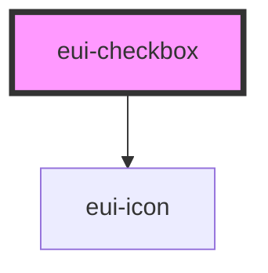

# eui-checkbox

<!-- Auto Generated Below -->

## Properties

| Property     | Attribute    | Description | Type                                           | Default                                |
| ------------ | ------------ | ----------- | ---------------------------------------------- | -------------------------------------- |
| `mode`       | `mode`       |             | `"fill" \| "outline"`                          | `"fill"`                               |
| `size`       | `size`       |             | `"lg" \| "md" \| "sm"`                         | `"md"`                                 |
| `states`     | `states`     |             | `("null" \| "false" \| "partial" \| "true")[]` | `['null', 'false', 'partial', 'true']` |
| `styleValue` | `stylevalue` |             | `string \| undefined`                          | `undefined`                            |
| `value`      | `value`      |             | `"false" \| "null" \| "partial" \| "true"`     | `'null'`                               |

## Events

| Event         | Description | Type                                                    |
| ------------- | ----------- | ------------------------------------------------------- |
| `valueChange` |             | `CustomEvent<"false" \| "null" \| "partial" \| "true">` |

## Dependencies

### Depends on

- [eui-icon](../icon)

### Graph

----------------------------------------------

*Built with [StencilJS](https://stenciljs.com/)*
