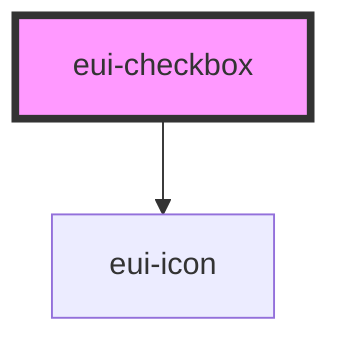

# eui-checkbox

<!-- Auto Generated Below -->

## Properties

| Property      | Attribute    | Description | Type                                           | Default                                |
| ------------- | ------------ | ----------- | ---------------------------------------------- | -------------------------------------- |
| `mode`        | `mode`       |             | `"fill" \| "outline"`                          | `"fill"`                               |
| `nativeAttrs` | --           |             | `any \| string \| undefined`                   | `undefined`                            |
| `size`        | `size`       |             | `"lg" \| "md" \| "sm"`                         | `"md"`                                 |
| `states`      | --           |             | `("true" \| "false" \| "null" \| "partial")[]` | `['null', 'false', 'partial', 'true']` |
| `styleValue`  | `stylevalue` |             | `string \| undefined`                          | `undefined`                            |
| `value`       | `value`      |             | `"false" \| "null" \| "partial" \| "true"`     | `'null'`                               |

## Events

| Event         | Description | Type                                                    |
| ------------- | ----------- | ------------------------------------------------------- |
| `valueChange` |             | `CustomEvent<"false" \| "null" \| "partial" \| "true">` |

## Slots

| Slot | Description      |
| ---- | ---------------- |
|      | The default slot |

## Dependencies

### Depends on

- [eui-icon](../icon)

### Graph

```mermaid
graph TD;
  eui-checkbox --> eui-icon
  style eui-checkbox fill:#f9f,stroke:#333,stroke-width:4px
```

----------------------------------------------

*Built with [StencilJS](https://stenciljs.com/)*
