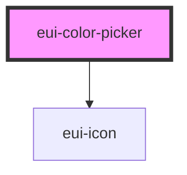

# eui-color-picker

<!-- Auto Generated Below -->

## Properties

| Property | Attribute | Description | Type                                | Default     |
| -------- | --------- | ----------- | ----------------------------------- | ----------- |
| `mode`   | `mode`    |             | `"compact" \| "full" \| "standard"` | `"compact"` |

## Events

| Event     | Description | Type                  |
| --------- | ----------- | --------------------- |
| `changed` |             | `CustomEvent<string>` |

## Dependencies

### Depends on

- [eui-icon](../icon)

### Graph

----------------------------------------------

*Built with [StencilJS](https://stenciljs.com/)*
