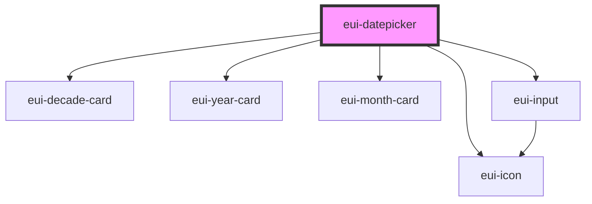

# eui-datepicker

<!-- Auto Generated Below -->

## Properties

| Property        | Attribute       | Description | Type                  | Default      |
| --------------- | --------------- | ----------- | --------------------- | ------------ |
| `date`          | `date`          |             | `Date`                | `new Date()` |
| `defaultValue`  | `defaultvalue`  |             | `string`              | `''`         |
| `displayField`  | `displayfield`  |             | `string \| undefined` | `undefined`  |
| `noClearButton` | `noclearbutton` |             | `boolean`             | `false`      |
| `placeholder`   | `placeholder`   |             | `string`              | `''`         |
| `styleValue`    | `stylevalue`    |             | `string \| undefined` | `undefined`  |
| `suggestions`   | `suggestions`   |             | `any[]`               | `[]`         |

## Events

| Event          | Description | Type               |
| -------------- | ----------- | ------------------ |
| `itemSelected` |             | `CustomEvent<any>` |

## Dependencies

### Depends on

- [eui-decade-card](../calendars/eui-calendar-body)
- [eui-year-card](../calendars/eui-calendar-body)
- [eui-month-card](../calendars/eui-calendar-body)
- [eui-input](../input)
- [eui-icon](../icon)

### Graph

----------------------------------------------

*Built with [StencilJS](https://stenciljs.com/)*
