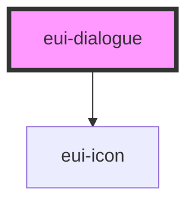

# eui-dialogue

<!-- Auto Generated Below -->

## Properties

| Property        | Attribute       | Description | Type                                                        | Default      |
| --------------- | --------------- | ----------- | ----------------------------------------------------------- | ------------ |
| `headerMessage` | `headermessage` |             | `string`                                                    | `"MESSAGE!"` |
| `styleValue`    | `stylevalue`    |             | `string \| undefined`                                       | `undefined`  |
| `variant`       | `variant`       |             | `"danger" \| "info" \| "primary" \| "success" \| "warning"` | `'primary'`  |

## Dependencies

### Depends on

- [eui-icon](../icon)

### Graph

----------------------------------------------

*Built with [StencilJS](https://stenciljs.com/)*
