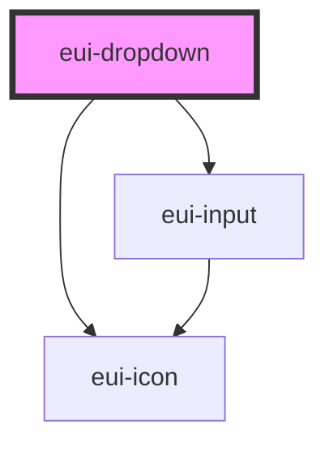

# eui-dropdown

<!-- Auto Generated Below -->

## Properties

| Property       | Attribute       | Description | Type                  | Default     |
| -------------- | --------------- | ----------- | --------------------- | ----------- |
| `data`         | `data`          |             | `any[]`               | `[]`        |
| `displayField` | `display-field` |             | `string \| undefined` | `undefined` |
| `placeholder`  | `placeholder`   |             | `string`              | `''`        |
| `suggestions`  | `suggestions`   |             | `any[]`               | `[]`        |

## Events

| Event          | Description | Type               |
| -------------- | ----------- | ------------------ |
| `itemSelected` |             | `CustomEvent<any>` |

## Dependencies

### Depends on

- [eui-icon](../icon)
- [eui-input](../input)

### Graph

----------------------------------------------

*Built with [StencilJS](https://stenciljs.com/)*
