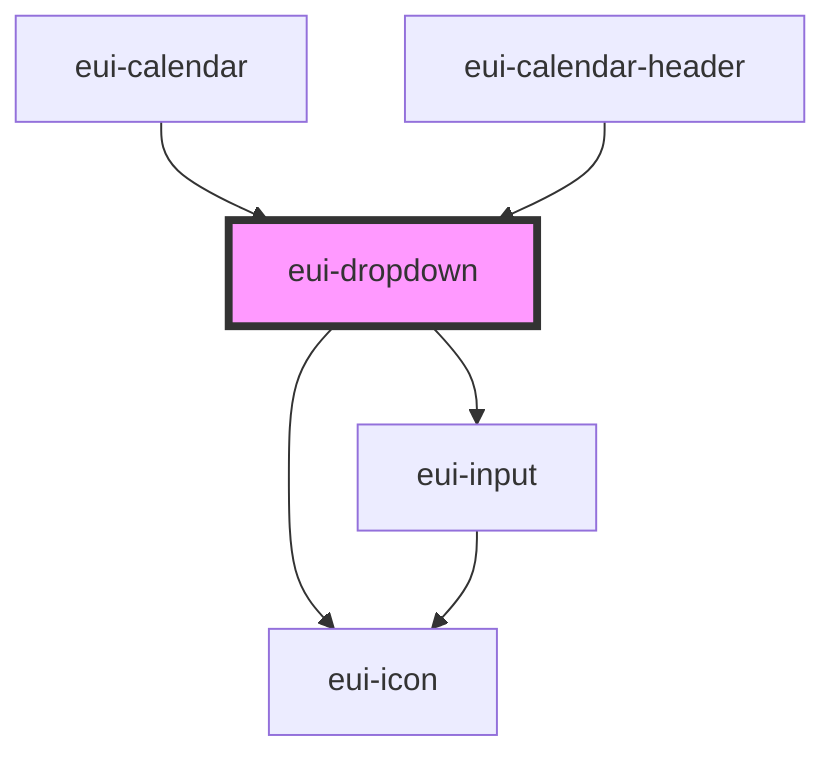

# eui-dropdown

<!-- Auto Generated Below -->

## Properties

| Property        | Attribute       | Description | Type                  | Default     |
| --------------- | --------------- | ----------- | --------------------- | ----------- |
| `data`          | `data`          |             | `any[]`               | `[]`        |
| `defaultValue`  | `defaultvalue`  |             | `string`              | `''`        |
| `displayField`  | `displayfield`  |             | `string \| undefined` | `undefined` |
| `noClearButton` | `noclearbutton` |             | `boolean`             | `false`     |
| `placeholder`   | `placeholder`   |             | `string`              | `''`        |
| `styleValue`    | `stylevalue`    |             | `string \| undefined` | `undefined` |
| `suggestions`   | `suggestions`   |             | `any[]`               | `[]`        |

## Events

| Event          | Description | Type               |
| -------------- | ----------- | ------------------ |
| `itemSelected` |             | `CustomEvent<any>` |

## Dependencies

### Used by

 - [eui-calendar](../calendars)
 - [eui-calendar-header](../calendars/eui-calendar-body)

### Depends on

- [eui-icon](../icon)
- [eui-input](../input)

### Graph

```mermaid
graph TD;
  eui-dropdown --> eui-icon
  eui-dropdown --> eui-input
  eui-input --> eui-icon
  eui-calendar --> eui-dropdown
  eui-calendar-header --> eui-dropdown
  style eui-dropdown fill:#f9f,stroke:#333,stroke-width:4px
```

----------------------------------------------

*Built with [StencilJS](https://stenciljs.com/)*
