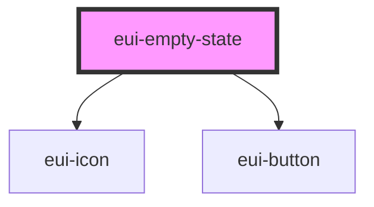

# eui-empty-state

<!-- Auto Generated Below -->

## Properties

| Property          | Attribute         | Description | Type                         | Default     |
| ----------------- | ----------------- | ----------- | ---------------------------- | ----------- |
| `icon`            | `icon`            |             | `string \| undefined`        | `undefined` |
| `nativeAttrs`     | --                |             | `any \| string \| undefined` | `undefined` |
| `primaryAction`   | `primaryaction`   |             | `string \| undefined`        | `undefined` |
| `secondaryAction` | `secondaryaction` |             | `string \| undefined`        | `undefined` |
| `styleValue`      | `stylevalue`      |             | `string \| undefined`        | `undefined` |

## Events

| Event            | Description | Type               |
| ---------------- | ----------- | ------------------ |
| `primaryClick`   |             | `CustomEvent<any>` |
| `secondaryClick` |             | `CustomEvent<any>` |

## Slots

| Slot | Description      |
| ---- | ---------------- |
|      | The default slot |

## Dependencies

### Depends on

- [eui-icon](../icon)
- [eui-button](../button)

### Graph

----------------------------------------------

*Built with [StencilJS](https://stenciljs.com/)*
