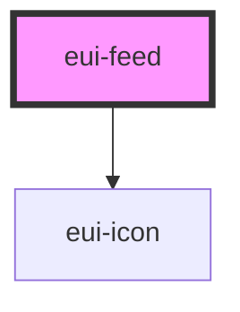

# eui-feed

<!-- Auto Generated Below -->

## Properties

| Property     | Attribute    | Description | Type                                                                          | Default                                                                    |
| ------------ | ------------ | ----------- | ----------------------------------------------------------------------------- | -------------------------------------------------------------------------- |
| `data`       | `data`       |             | `FeedData[]`                                                                  | `[{ Title: "placeholder", description: "A placeholder description for" }]` |
| `mode`       | `mode`       |             | `FeedMode.career \| FeedMode.comment \| FeedMode.events \| FeedMode.timeLine` | `FeedMode.timeLine`                                                        |
| `styleValue` | `stylevalue` |             | `string \| undefined`                                                         | `undefined`                                                                |

## Dependencies

### Depends on

- [eui-icon](../icon)

### Graph

----------------------------------------------

*Built with [StencilJS](https://stenciljs.com/)*
