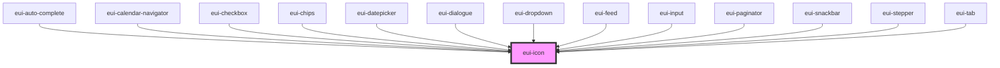

# eui-icon

<!-- Auto Generated Below -->

## Properties

| Property     | Attribute    | Description | Type                                        | Default     |
| ------------ | ------------ | ----------- | ------------------------------------------- | ----------- |
| `name`       | `name`       |             | `string`                                    | `''`        |
| `styleValue` | `stylevalue` |             | `string \| undefined`                       | `undefined` |
| `type`       | `type`       |             | `"micro" \| "mini" \| "outline" \| "solid"` | `'micro'`   |

## Dependencies

### Used by

 - [eui-auto-complete](../autocomplete)
 - [eui-calendar-navigator](../calendars/eui-calendar-body)
 - [eui-checkbox](../checkbox)
 - [eui-chips](../chips)
 - [eui-datepicker](../datepicker)
 - [eui-dialogue](../dialogue)
 - [eui-dropdown](../dropdown)
 - [eui-feed](../feed)
 - [eui-input](../input)
 - [eui-paginator](../paginator)
 - [eui-snackbar](../snackbar)
 - [eui-stepper](../stepper)
 - [eui-tab](../tab)

### Graph

```mermaid
graph TD;
  eui-auto-complete --> eui-icon
  eui-calendar-navigator --> eui-icon
  eui-checkbox --> eui-icon
  eui-chips --> eui-icon
  eui-datepicker --> eui-icon
  eui-dialogue --> eui-icon
  eui-dropdown --> eui-icon
  eui-feed --> eui-icon
  eui-input --> eui-icon
  eui-paginator --> eui-icon
  eui-snackbar --> eui-icon
  eui-stepper --> eui-icon
  eui-tab --> eui-icon
  style eui-icon fill:#f9f,stroke:#333,stroke-width:4px
```

----------------------------------------------

*Built with [StencilJS](https://stenciljs.com/)*
