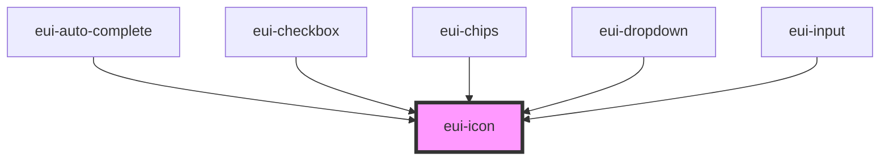

# eui-icon

<!-- Auto Generated Below -->

## Properties

| Property | Attribute | Description | Type                                        | Default   |
| -------- | --------- | ----------- | ------------------------------------------- | --------- |
| `name`   | `name`    |             | `string`                                    | `''`      |
| `type`   | `type`    |             | `"micro" \| "mini" \| "outline" \| "solid"` | `'micro'` |

## Dependencies

### Used by

 - [eui-auto-complete](../autocomplete)
 - [eui-checkbox](../checkbox)
 - [eui-chips](../chips)
 - [eui-dropdown](../dropdown)
 - [eui-input](../input)

### Graph

----------------------------------------------

*Built with [StencilJS](https://stenciljs.com/)*
