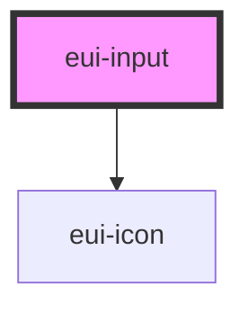

# eui-input

<!-- Auto Generated Below -->

## Properties

| Property     | Attribute    | Description | Type                                                                                                                                                                                                                 | Default                                            |
| ------------ | ------------ | ----------- | -------------------------------------------------------------------------------------------------------------------------------------------------------------------------------------------------------------------- | -------------------------------------------------- |
| `alert`      | `alert`      |             | `{ message: string; type: "danger" \| "success"; }`                                                                                                                                                                  | `{ message: "There's an error!", type: "danger" }` |
| `mode`       | `mode`       |             | `"normal" \| "outline" \| "text-input"`                                                                                                                                                                              | `'normal'`                                         |
| `style`      | `style`      |             | `string \| undefined`                                                                                                                                                                                                | `undefined`                                        |
| `type`       | `type`       |             | `string`                                                                                                                                                                                                             | `'text'`                                           |
| `validation` | `validation` |             | `undefined \| ({ required?: boolean \| undefined; minLength?: number \| undefined; maxLength?: number \| undefined; pattern?: RegExp \| undefined; custom?: ((value: string) => string \| boolean) \| undefined; })` | `undefined`                                        |

## Dependencies

### Depends on

- [eui-icon](../icon)

### Graph

----------------------------------------------

*Built with [StencilJS](https://stenciljs.com/)*
