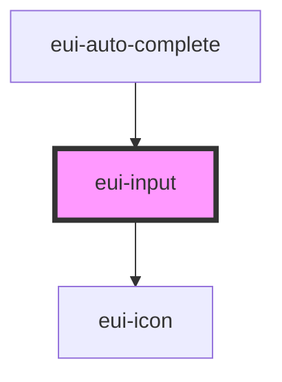

# eui-input

<!-- Auto Generated Below -->

## Properties

| Property      | Attribute     | Description                                                    | Type                                                                                                                                                                                                                 | Default                                            |
| ------------- | ------------- | -------------------------------------------------------------- | -------------------------------------------------------------------------------------------------------------------------------------------------------------------------------------------------------------------- | -------------------------------------------------- |
| `alert`       | `alert`       |                                                                | `{ message: string; type: "danger" \| "success"; }`                                                                                                                                                                  | `{ message: "There's an error!", type: "danger" }` |
| `max`         | `max`         |                                                                | `number \| undefined`                                                                                                                                                                                                | `undefined`                                        |
| `min`         | `min`         |                                                                | `number \| undefined`                                                                                                                                                                                                | `undefined`                                        |
| `mode`        | `mode`        |                                                                | `"normal" \| "outline" \| "text-input"`                                                                                                                                                                              | `'normal'`                                         |
| `placeholder` | `placeholder` |                                                                | `string`                                                                                                                                                                                                             | `''`                                               |
| `step`        | `step`        |                                                                | `number`                                                                                                                                                                                                             | `1`                                                |
| `styleValue`  | `style-value` |                                                                | `string \| undefined`                                                                                                                                                                                                | `''`                                               |
| `type`        | `type`        |                                                                | `string`                                                                                                                                                                                                             | `'text'`                                           |
| `validation`  | `validation`  |                                                                | `undefined \| ({ required?: boolean \| undefined; minLength?: number \| undefined; maxLength?: number \| undefined; pattern?: RegExp \| undefined; custom?: ((value: string) => string \| boolean) \| undefined; })` | `undefined`                                        |
| `value`       | `value`       | External value prop (mutable so it can be updated from parent) | `string`                                                                                                                                                                                                             | `''`                                               |

## Dependencies

### Used by

 - [eui-auto-complete](../autocomplete)

### Depends on

- [eui-icon](../icon)

### Graph

----------------------------------------------

*Built with [StencilJS](https://stenciljs.com/)*
