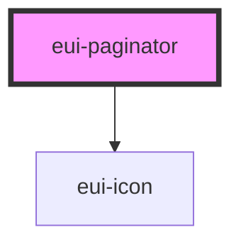

# eui-paginator

<!-- Auto Generated Below -->

## Properties

| Property             | Attribute            | Description | Type                  | Default     |
| -------------------- | -------------------- | ----------- | --------------------- | ----------- |
| `defaultCurrentPage` | `defaultcurrentpage` |             | `number`              | `1`         |
| `disabled`           | `disabled`           |             | `boolean`             | `false`     |
| `styleValue`         | `stylevalue`         |             | `string \| undefined` | `undefined` |
| `totalPages`         | `totalpages`         |             | `number`              | `1`         |

## Events

| Event         | Description | Type               |
| ------------- | ----------- | ------------------ |
| `currentPage` |             | `CustomEvent<any>` |

## Dependencies

### Depends on

- [eui-icon](../icon)

### Graph

----------------------------------------------

*Built with [StencilJS](https://stenciljs.com/)*
