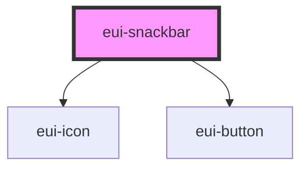

# eui-snackbar

<!-- Auto Generated Below -->

## Properties

| Property     | Attribute    | Description | Type                                                        | Default                     |
| ------------ | ------------ | ----------- | ----------------------------------------------------------- | --------------------------- |
| `awakeTime`  | `awaketime`  |             | `number \| undefined`                                       | `undefined`                 |
| `dismiss`    | `dismiss`    |             | `boolean`                                                   | `false`                     |
| `header`     | `header`     |             | `string \| undefined`                                       | `undefined`                 |
| `icon`       | `icon`       |             | `string \| undefined`                                       | `undefined`                 |
| `message`    | `message`    |             | `string`                                                    | `"Placeholder for message"` |
| `open`       | `open`       |             | `boolean`                                                   | `false`                     |
| `styleValue` | `stylevalue` |             | `string \| undefined`                                       | `undefined`                 |
| `variant`    | `variant`    |             | `"danger" \| "info" \| "neutral" \| "success" \| "warning"` | `'info'`                    |

## Dependencies

### Depends on

- [eui-icon](../icon)
- [eui-button](../button)

### Graph

----------------------------------------------

*Built with [StencilJS](https://stenciljs.com/)*
