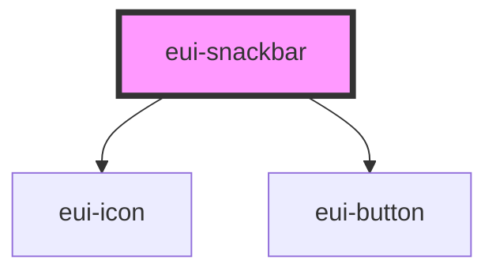

# eui-snackbar

<!-- Auto Generated Below -->

## Properties

| Property      | Attribute    | Description | Type                                                        | Default                     |
| ------------- | ------------ | ----------- | ----------------------------------------------------------- | --------------------------- |
| `awakeTime`   | `awaketime`  |             | `number`                                                    | `1000`                      |
| `dismiss`     | `dismiss`    |             | `boolean`                                                   | `false`                     |
| `header`      | `header`     |             | `string \| undefined`                                       | `undefined`                 |
| `icon`        | `icon`       |             | `string \| undefined`                                       | `undefined`                 |
| `message`     | `message`    |             | `string`                                                    | `'Placeholder for message'` |
| `nativeAttrs` | --           |             | `any \| string \| undefined`                                | `undefined`                 |
| `open`        | `open`       |             | `boolean`                                                   | `false`                     |
| `styleValue`  | `stylevalue` |             | `string \| undefined`                                       | `undefined`                 |
| `variant`     | `variant`    |             | `"danger" \| "info" \| "neutral" \| "success" \| "warning"` | `'info'`                    |

## Events

| Event        | Description | Type                |
| ------------ | ----------- | ------------------- |
| `dismissing` |             | `CustomEvent<void>` |

## Dependencies

### Depends on

- [eui-icon](../icon)
- [eui-button](../button)

### Graph

```mermaid
graph TD;
  eui-snackbar --> eui-icon
  eui-snackbar --> eui-button
  style eui-snackbar fill:#f9f,stroke:#333,stroke-width:4px
```

----------------------------------------------

*Built with [StencilJS](https://stenciljs.com/)*
