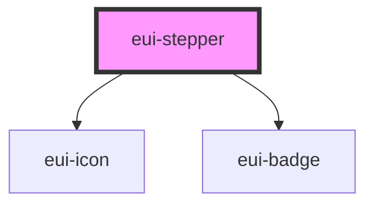

# eui-stepper

<!-- Auto Generated Below -->

## Properties

| Property      | Attribute      | Description | Type                         | Default        |
| ------------- | -------------- | ----------- | ---------------------------- | -------------- |
| `currentStep` | `current-step` |             | `number`                     | `0`            |
| `orientation` | `orientation`  |             | `"horizontal" \| "vertical"` | `"horizontal"` |
| `steps`       | `steps`        |             | `string[]`                   | `[]`           |
| `styleValue`  | `stylevalue`   |             | `string \| undefined`        | `undefined`    |

## Events

| Event        | Description | Type                  |
| ------------ | ----------- | --------------------- |
| `stepSelect` |             | `CustomEvent<number>` |

## Dependencies

### Depends on

- [eui-icon](../icon)
- [eui-badge](../badge)

### Graph

----------------------------------------------

*Built with [StencilJS](https://stenciljs.com/)*
