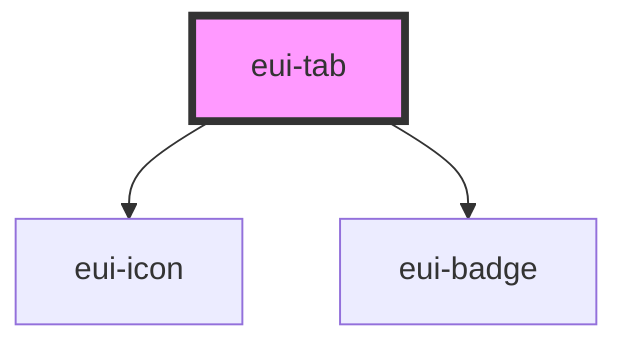

# eui-tab

<!-- Auto Generated Below -->

## Properties

| Property      | Attribute     | Description | Type                  | Default     |
| ------------- | ------------- | ----------- | --------------------- | ----------- |
| `collapse`    | `collapse`    |             | `boolean`             | `false`     |
| `data`        | `data`        |             | `TabData[]`           | `[]`        |
| `disabled`    | `disabled`    |             | `boolean`             | `false`     |
| `selectedTab` | `selectedtab` |             | `number`              | `0`         |
| `styleValue`  | `stylevalue`  |             | `string \| undefined` | `undefined` |

## Events

| Event          | Description | Type               |
| -------------- | ----------- | ------------------ |
| `itemSelected` |             | `CustomEvent<any>` |

## Dependencies

### Depends on

- [eui-icon](../icon)
- [eui-badge](../badge)

### Graph

----------------------------------------------

*Built with [StencilJS](https://stenciljs.com/)*
