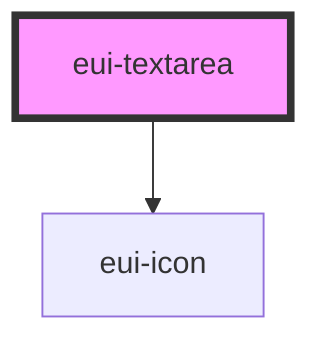

# eui-textarea

<!-- Auto Generated Below -->

## Properties

| Property        | Attribute       | Description                                                    | Type                                                                                                                                                                                                                 | Default                                            |
| --------------- | --------------- | -------------------------------------------------------------- | -------------------------------------------------------------------------------------------------------------------------------------------------------------------------------------------------------------------- | -------------------------------------------------- |
| `alert`         | `alert`         |                                                                | `{ message: string; type: "danger" \| "success"; }`                                                                                                                                                                  | `{ message: "There's an error!", type: "danger" }` |
| `max`           | `max`           |                                                                | `number \| undefined`                                                                                                                                                                                                | `undefined`                                        |
| `min`           | `min`           |                                                                | `number \| undefined`                                                                                                                                                                                                | `undefined`                                        |
| `mode`          | `mode`          |                                                                | `"normal" \| "outline" \| "text-textarea"`                                                                                                                                                                           | `'normal'`                                         |
| `nativeAttrs`   | `native-attrs`  |                                                                | `undefined \| { [x: string]: any; }`                                                                                                                                                                                 | `undefined`                                        |
| `noClearButton` | `noclearbutton` |                                                                | `boolean`                                                                                                                                                                                                            | `false`                                            |
| `placeholder`   | `placeholder`   |                                                                | `string`                                                                                                                                                                                                             | `''`                                               |
| `showClear`     | `showclear`     |                                                                | `boolean \| undefined`                                                                                                                                                                                               | `true`                                             |
| `step`          | `step`          |                                                                | `number`                                                                                                                                                                                                             | `1`                                                |
| `styleValue`    | `stylevalue`    |                                                                | `string \| undefined`                                                                                                                                                                                                | `undefined`                                        |
| `type`          | `type`          |                                                                | `string`                                                                                                                                                                                                             | `'text'`                                           |
| `validation`    | `validation`    |                                                                | `undefined \| ({ required?: boolean \| undefined; minLength?: number \| undefined; maxLength?: number \| undefined; pattern?: RegExp \| undefined; custom?: ((value: string) => string \| boolean) \| undefined; })` | `undefined`                                        |
| `value`         | `value`         | External value prop (mutable so it can be updated from parent) | `string`                                                                                                                                                                                                             | `''`                                               |

## Events

| Event      | Description | Type               |
| ---------- | ----------- | ------------------ |
| `change`   |             | `CustomEvent<any>` |
| `clear`    |             | `CustomEvent<any>` |
| `keyDown`  |             | `CustomEvent<any>` |
| `keyPress` |             | `CustomEvent<any>` |
| `keyUp`    |             | `CustomEvent<any>` |

## Dependencies

### Depends on

- [eui-icon](../icon)

### Graph

----------------------------------------------

*Built with [StencilJS](https://stenciljs.com/)*
