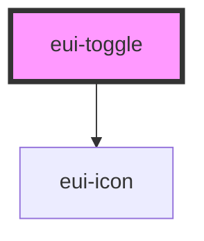

# eui-toggle

<!-- Auto Generated Below -->

## Properties

| Property     | Attribute    | Description | Type                  | Default     |
| ------------ | ------------ | ----------- | --------------------- | ----------- |
| `data`       | `data`       |             | `ToggleItem[]`        | `[]`        |
| `disabled`   | `disabled`   |             | `boolean`             | `false`     |
| `styleValue` | `stylevalue` |             | `string \| undefined` | `undefined` |
| `value`      | `value`      |             | `number`              | `0`         |

## Events

| Event          | Description | Type                  |
| -------------- | ----------- | --------------------- |
| `valueChanged` |             | `CustomEvent<number>` |

## Dependencies

### Depends on

- [eui-icon](../icon)

### Graph

----------------------------------------------

*Built with [StencilJS](https://stenciljs.com/)*
