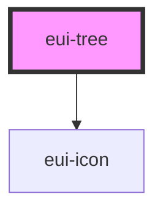

# eui-tree

<!-- Auto Generated Below -->

## Properties

| Property     | Attribute    | Description | Type                  | Default     |
| ------------ | ------------ | ----------- | --------------------- | ----------- |
| `collapse`   | `collapse`   |             | `boolean`             | `false`     |
| `data`       | `data`       |             | `TreeData[]`          | `[]`        |
| `styleValue` | `stylevalue` |             | `string \| undefined` | `undefined` |

## Dependencies

### Depends on

- [eui-icon](../icon)

### Graph

----------------------------------------------

*Built with [StencilJS](https://stenciljs.com/)*
